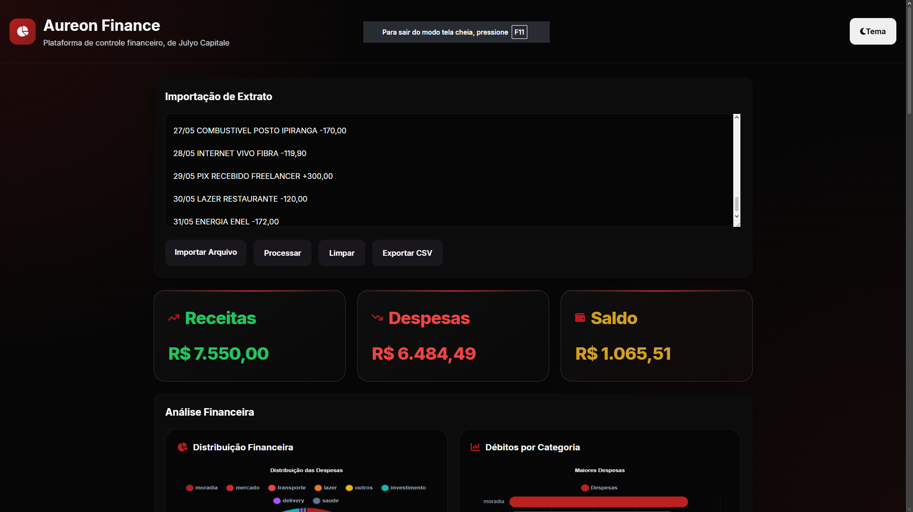
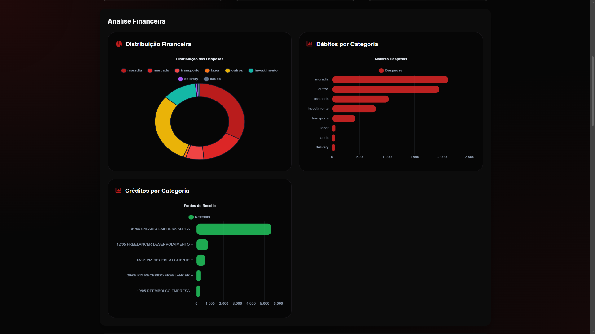

# 💰 Aureon Finance

Uma plataforma moderna de análise financeira pessoal que transforma extratos bancários em insights inteligentes.

O Aureon Finance permite importar extratos em formato texto, identificar automaticamente receitas e despesas, categorizar transações, gerar indicadores financeiros e visualizar o comportamento financeiro através de dashboards interativos.

Acesse o projeto pelo Link: https://jullyoo.github.io/Aureon-Finance/

---

## 🚀 Demonstração

### Tela Principal



### Gráficos



### Dashboard


### Demonstração


---

## ✨ Funcionalidades

### 📥 Importação de Extratos

* Upload de arquivos `.txt`
* Processamento automático de movimentações
* Identificação de créditos e débitos
* Validação de registros

### 🤖 Categorização Inteligente

* Alimentação
* Transporte
* Moradia
* Saúde
* Educação
* Lazer
* Investimentos
* Salário
* Outros

### 📊 Dashboard Financeiro

* Saldo Atual
* Total de Receitas
* Total de Despesas
* Fluxo de Caixa
* Percentual de Gastos
* Indicadores Financeiros

### 📈 Visualizações

* Gráfico de Pizza por Categoria
* Distribuição de Gastos
* Resumo Financeiro
* Evolução de Receitas e Despesas

### 📋 Gestão de Transações

* Listagem completa
* Pesquisa em tempo real
* Filtros
* Exclusão de registros
* Atualização dinâmica

### 💾 Persistência Local

* Salvamento automático no navegador
* Recuperação de dados após recarregar a página

---

## 📁 Estrutura do Projeto

Projeto desenvolvido utilizando arquitetura modular em JavaScript ES Modules.

```text
AUREON-FINANCE/
│
├── assets/
│
├── css/
│   ├── base.css
│   ├── components.css
│   ├── index.css
│   ├── layout.css
│   └── themes.css
│
├── js/
│   ├── app.js
│   ├── categorias.js
│   ├── charts.js
│   ├── export.js
│   ├── parser.js
│   ├── script.js
│   ├── simulator.js
│   ├── state.js
│   ├── storage.js
│   ├── ui.js
│   └── utils.js
│
├── images/
│   ├── Dashboard.png
│   ├── Graficos.png
│   └── Inicio.png
│
├── extrato_teste.txt
├── index.html
│
└── README.md
```

---

## 🛠️ Tecnologias Utilizadas

### Front-end

* HTML5
* CSS3
* JavaScript ES6+

### Bibliotecas

* Chart.js

### Armazenamento

* LocalStorage

---

## 📂 Formato de Extrato Suportado

Exemplo:

```text
01/05 SALÁRIO EMPRESA ALPHA +5500,00
01/05 PIX RECEBIDO JOÃO +250,00
02/05 ALUGUEL APARTAMENTO -1800,00
03/05 MERCADO EXTRA -425,90
04/05 UBER TRIP -32,50
05/05 NETFLIX -39,90
```

O sistema identifica automaticamente:

* Data
* Descrição
* Tipo da movimentação
* Valor
* Categoria

---

## 📊 Indicadores Gerados

* Receita Total
* Despesa Total
* Saldo Líquido
* Categoria com Maior Gasto
* Percentual de Economia
* Distribuição Financeira

---

## 🎯 Objetivo do Projeto

Este projeto foi desenvolvido para demonstrar conhecimentos em:

* Desenvolvimento Front-end
* Manipulação de Dados
* Arquitetura Modular JavaScript
* Experiência do Usuário (UX)
* Visualização de Dados
* Boas Práticas de Código
* Organização de Projetos Profissionais

---

## 🚀 Como Executar

Clone o repositório:

```bash
git clone https://github.com/seuusuario/aureon-finance.git
```

Entre na pasta:

```bash
cd aureon-finance
```

Abra o arquivo:

```text
index.html
```

ou utilize:

```bash
Live Server
```

---

---

## 🔮 Próximas Melhorias

* Exportação para Excel
* Exportação para PDF
* Múltiplos Extratos
* Metas Financeiras
* IA para categorização avançada
* Comparação mensal
* Integração com APIs bancárias

---

## 👨‍💻 Autor

Julio Cesar Teixeira Guimarães

Estudante de Engenharia de Software, apaixonado por Desenvolvimento Web, Dados e Soluções Financeiras.

---

## 📄 Licença

Este projeto está sob a licença MIT.
